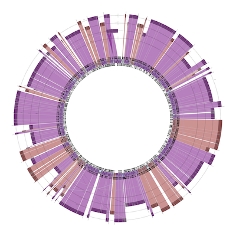
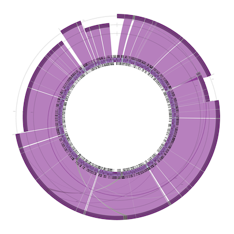
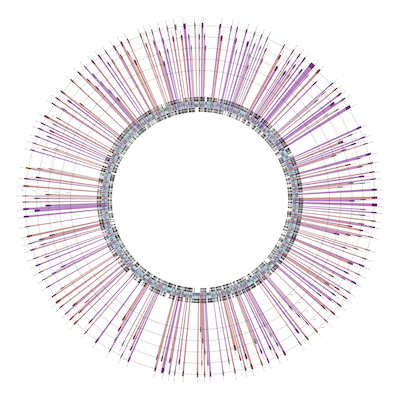

Python script(s) for visual assessment of (bacterial) assemblies
================================================================

Python code using Biopython and GenomeDiagram (calling ReportLab) to render
images of (bacterial) assemblies, with the goal of a visual summary especially
where a reference genome is available.

This is a work in progress, and has not yet been formally released. See the
TODO list at the end.

Explanation
===========

This script produces a GenomeDiagram using ReportLab, defaulting to circular
figures suitable for most bacterial genomes or plasmids, but linear diagrams
are also possible.

The central track is the reference genome drawn as a full circle in
dark grey, with any annotated genes shown in pale blue.

The outer tracks are used for any contig/scaffold which maps onto the main
chromosome, the vertical placement (height) is arbitrary and just to avoid
overlaps. The horizontal placement (radial position) is weighted to put
each contig/scaffold above where most of it maps.

The mappings between the contig/scaffold and the main chromosome are colour
coded, with the transparency set by the percentage identity (with the current
settings there is relatively little variation). This uses the cross-link
functionality added in Biopython 1.59, introduced in this blog post:
http://news.open-bio.org/news/2012/03/cross-links-in-genomediagram/

By default the colours are red/blue where a contig maps to the same strand
(red) or flipped to the opposite strand(blue). If most of a contig maps to
the reverse strand, it is drawn inverted and coloured purple/green instead.
I intend to add another example with some inversions to better explain this.

Regions of the genome not represented in the assembly are visible on the
central track as dark grey (with pale blue genes) with no cross-links.

Regions of the assembly not represented in the reference genome are visible
on the contigs as dark grey regions (often at either end of a contig).

Dependencies
============

* Python, tested with Python 2.7, available from http://python.org
* Biopython, tested with Biopython 1.62, available from http://biopython.org
* ReportLab, tested with ReportLab 2.6, available from http://reportlab.com
* NCBI BLAST+, tested with BLAST 2.2.27+, available from
  ftp://ftp.ncbi.nlm.nih.gov/blast/executables/blast+/

Sample Data - Example One
=========================

As an example, we will use the first public assembly of the 2011 Shiga-toxin
producing *Escherichia coli* O104:H4 outbreak in Germany. This was part of the
open-source crowd-sourcing analysis described in Rohde et al. (2011) and here:
https://github.com/ehec-outbreak-crowdsourced/BGI-data-analysis/wiki

You can download this FASTA file with 3,057 sequences for either of these URLs,
for example using the ``wget`` command under Linux:

* http://static.xbase.ac.uk/files/results/nick/TY2482/TY2482.fasta.txt
* https://github.com/ehec-outbreak-crowdsourced/BGI-data-analysis/blob/master/strains/TY2482/seqProject/BGI/assemblies/NickLoman/TY2482.fasta.txt

This FASTA file ``TY2482.fasta.txt`` was the initial TY-2482 strain assembled
by Nick Loman from 5 runs of Ion Torrent data released by the BGI, using the
MIRA 3.2 assembler. It was initially released via his blog,
http://pathogenomics.bham.ac.uk/blog/2011/06/ehec-genome-assembly/

We will also need a complete reference genome, ideally one which has been
annotated. With the advantage of hindsight, we can use the complete genome
from a closely related strain isolated from a US citizen infected in Germany
during the outbreak by downloading these two files:

* ftp://ftp.ncbi.nlm.nih.gov/genomes/Bacteria/Escherichia_coli_O104_H4_2011C_3493_uid176127/NC_018658.gbk
* ftp://ftp.ncbi.nlm.nih.gov/genomes/Bacteria/Escherichia_coli_O104_H4_2011C_3493_uid176127/NC_018658.fna

You will need to install the NCBI BLAST+ standalone tools, specifically we
will use ``makeblastdb`` and (from within the Python script) ``blastn``.
Now prepare a BLAST database from the reference FASTA file:

.. sourcecode:: console

    $ makeblastdb -in NC_018658.fna -dbtype nucl

You can now run this script using this command:

.. sourcecode:: console

    $ python assembly_comparison.py TY2482.fasta.txt NC_018658.fna
    ...
    Drawing 253 of the 2899 contigs/scaffolds, 1880904 bp
    Unplaced: 2804 contigs/scaffolds, 3610128 bp
    i.e. Placed 34% of the assembly
    ...

This will call ``blastn`` to produce tabluar output, then produce a PDF diagram
comparing the TY-2482 assembly to the full circle of the reference *E. coli*
strain.

All these contigs are very small, but the figure shows matches all the way round
the genome which is a good sign.

Sample Data - Example Two
=========================

Continuing this *E. coli* TY-2482 example, lets look at a later assembly from
the same strain - using the same reference genome downloaded and turned into
a BLAST database above:

.. sourcecode:: console

    $ wget ftp://ftp.genomics.org.cn/pub/Ecoli_TY-2482/Escherichia_coli_TY-2482.scaffold.20110610.fa.gz

After downloaded it, decompress it::

    $ gunzip Escherichia_coli_TY-2482.scaffold.20110610.fa.gz

And run the script:

.. sourcecode:: console

    $ python assembly_comparison.py Escherichia_coli_TY-2482.scaffold.20110610.fa NC_018658.fna
    ...
    Placed: 75 of the 452 contigs/scaffolds, 4994174 bp
    Unplaced: 377 contigs/scaffolds, 358513 bp
    i.e. Placed 93% of the assembly
    ...

The BGI released several versions of this genome during 2011, this was an
intermediate version and the figure shows it covers almost all of the full
genome in reasonably sized contigs - comparing the figures by eye we can see
this is a big improvement over the first assembly (the previous example).

Sample Data - Example Three
===========================

This is yet another *E. coli* assembly listed on that same wiki page, again download it:

.. sourcecode:: console

    $ wget https://github.com/ehec-outbreak-crowdsourced/BGI-data-analysis/raw/master/strains/H112180280/seqProject/HealthProtectionAgencyUK/assemblies/HPA_V2/EHEC_H112180280_HPA_scaffolds_reordered_vs_55989.fasta

And run the script:

.. sourcecode:: console

    $ python assembly_comparison.py EHEC_H112180280_HPA_scaffolds_reordered_vs_55989.fasta NC_018658.fna
    ...
    Placed: 7 of the 13 contigs/scaffolds, 5233123 bp
    Unplaced: 6 contigs/scaffolds, 171958 bp
    i.e. Placed 97% of the assembly
    ....

This is for second assembly of the H112180280 strain sequenced by the Health
Protection Agency (UK), and it had just 13 large scaffolds:

This time the figure shows six sequences mapping very nicely onto the reference genome
main chromosome (I presume the other four sequences are plasmids).

TODO
====

* Proper command line API including specification of output PDF filename
  and the tabular BLAST results.

* Auto-generate reference FASTA file if given just GenBank/EMBL file?

* Control over sequence similarity thresholds.

* Control over linear or circular output.

* Multiple reference sequences (e.g. plasmids), perhaps as separate pages?
  What about contigs hitting multiple plasmids?

* Try BLAT etc instead of BLASTN.

* Control over the colours?

* Galaxy wrapper?

* etc

